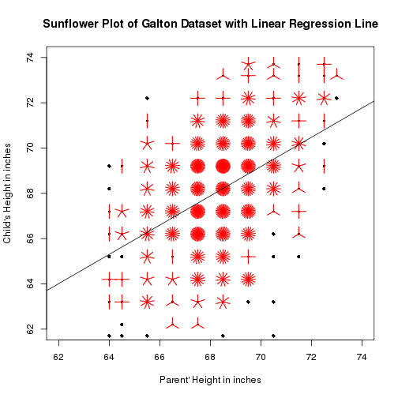

## Predicte Child's adult height using glaton dataset

1. Dataset used by Galton in 1885 to study the relationship between a parent's height and their childrens.
2. A data frame with 928 observations on the following 2 variables.
3. child = The child's height in inches
4. parent = The “midparent” height in inches
5. The midparent's height is an average of the fathers height and 1.08 times the mother's.


```r
dim(galton)
```

```
## [1] 928   2
```

```r
names(galton)
```

```
## [1] "child"  "parent"
```

--- .class #id 

## Data Processing

1.User enter mother's height in inches.

2.User enter father's height in inches.

3.Create linear regression model.


```r
        mdLm <- lm(child ~ parent, data=galton)
```

4.Calculate parent midparent's height from input value.

        mP <- (input$fHeight + 1.08*input$mHeight)/2
5.Prediction of child's height with parent midparent's height.

        round(predict(mdLm,data.frame(parent = mP)),0)
        

      

--- .class #id 

## Result Presentation

1. We use predicted child's height as boy's adult height.
2. We use predicted child's height divided by 1.08 as Girl's adult height.
3. Sunflower Plot of Galton Dataset with Linear Regression Li

        sunflowerplot(galton$parent, galton$child, xlim=c(62,74), 
        ylim=c(62,74), xlab="Parent' Height in inches", 
        ylab="Child's Height in inches",
        main="Sunflower Plot of Galton Dataset with Linear Regression Line")
        abline(mdLm)
        
4. Plot points with inputed midparent's height and predicted child's height.


--- .class #id 


## Galton Dataset with Linear Regression Line

 


